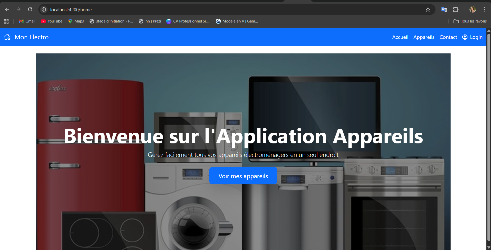
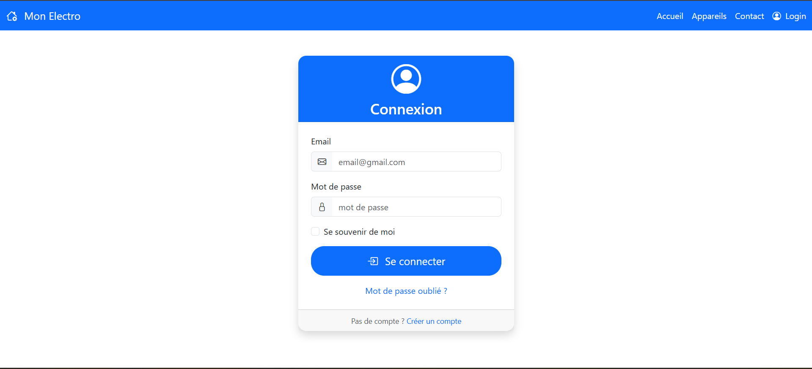
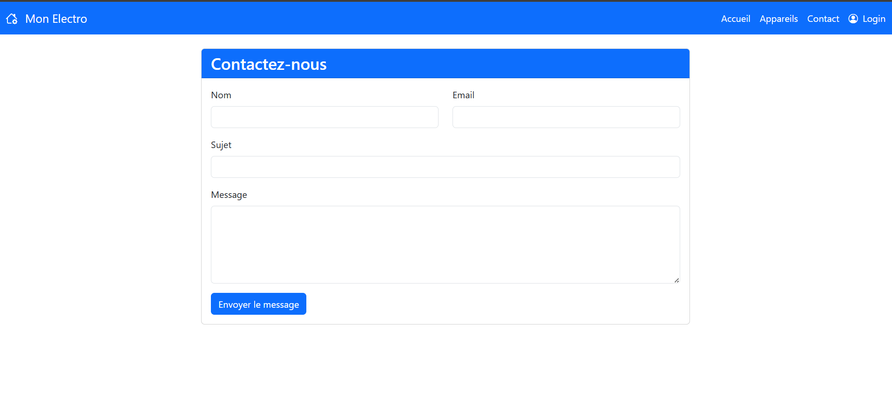
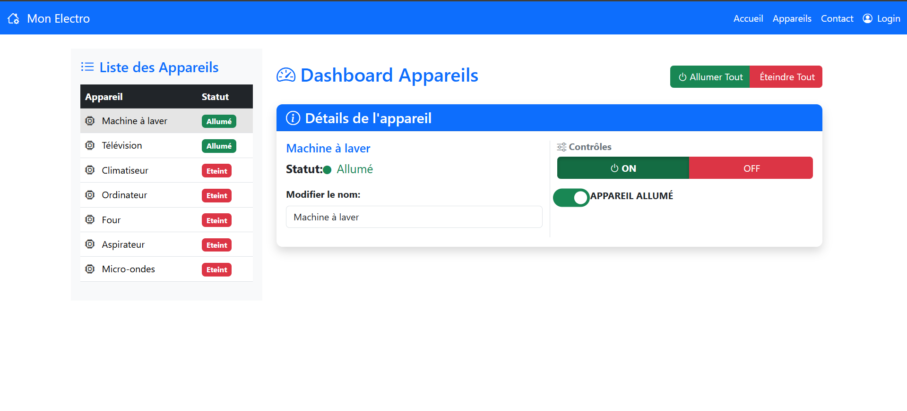
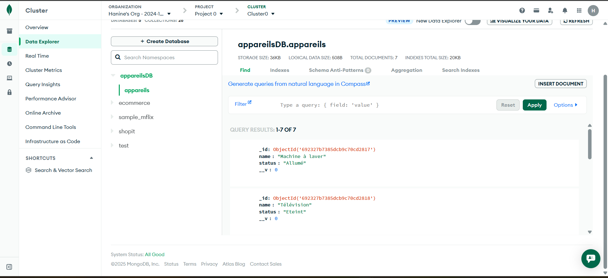

🏠 Application de Gestion d'Appareils Connectés
📱 Aperçu de l'Application

🖥️ Interface Principale - Dashboard

Interface principale 

Login

Contract

Contrôle des Appareils

Boutons de contrôle ON/OFF avec indicateurs de statut

## DB

🚀 Description du Projet
Une application FullStack moderne permettant de gérer et contrôler vos appareils électroménagers connectés en temps réel.

✨ Fonctionnalités Principales
✅ Visualisation temps réel du statut des appareils

✅ Contrôle individuel (Allumer/Éteindre chaque appareil)

✅ Contrôle global (Allumer/Éteindre tous les appareils)

✅ Modification instantanée des noms d'appareils

✅ Sauvegarde automatique dans la base de données

✅ Interface responsive compatible mobile/desktop

🛠️ Technologies Utilisées
Frontend : Angular 17, Bootstrap 5, TypeScript

Backend : Node.js, Express.js, MongoDB

Déploiement : Docker, Docker Compose

🎯 Utilisation Simple
bash
# Démarrage avec Docker
docker-compose up -d

# Accès à l'application
http://localhost
